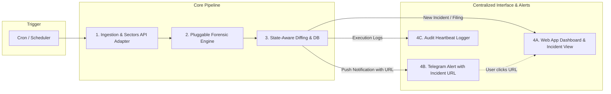
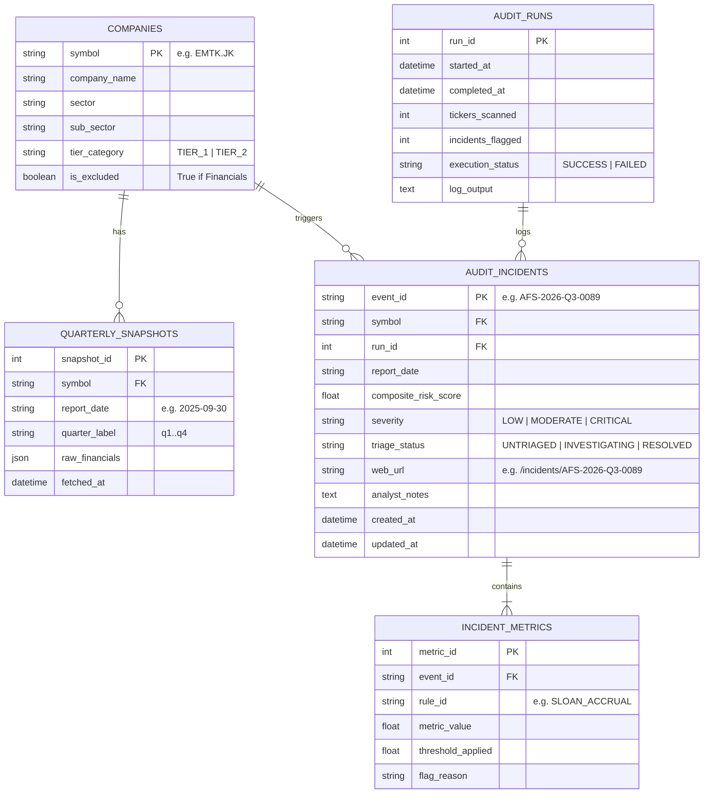

# 🏗️ High-Level Design (HLD): Autonomous Forensic Sentinel (AFS)
**Dokumen Desain Arsitektur Sistem Intelijen & Audit Forensik Finansial Otonom (BEI / IDX)**

* **Versi:** 3.0 (API-Verified Forensic Analytics & Centered Web App with Telegram Deep-Linking)
* **Target Kompetisi:** Sectors Hackathon 2026 — Track 2 (*Automation & Workflows*)
* **Prinsip Desain Utama:** *API-Validated Forensic Core, Pluggable Strategy Pattern, Centralized Web App Command Center, Direct Telegram Deep-Linking, & Idempotent State Engine*.

---

## 1. 🎯 Ikhtisar Sistem & Filosofi Desain

Sistem **Autonomous Forensic Sentinel (AFS)** dirancang sebagai *pipeline* audit risiko dan kualitas laba finansial yang berjalan secara otomatis tanpa intervensi manusia (*unattended autonomous workflow*).

Berdasarkan analisis validasi ketersediaan data pada **Sectors Financial API v2** (merujuk pada riset `Risk Analisis.md`), AFS Sentinel mengintegrasikan kombinasi indikator forensik yang **100% terverifikasi didukung oleh API**, mencakup:
1. **Sloan Accrual Ratio** (Evaluasi Kualitas Laba Akrual vs Kas Operasi Riil).
2. **Cash vs Earnings YoY Divergence** (Deteksi Pola Divergensi Laba Naik vs Kas Operasi Anjlok).
3. **Beneish Adapted Sub-Indices** (GMI, SGI, TATA, LVGI).
4. **Altman Z-Score Bankruptcy Index** (Model Prediksi Distress Finansial).
5. **Insider Dumping Monitor** (Pelacakan Otonom Transaksi Ordal via `GET /v2/filings/`).
6. **Dividend Inconsistency / Phantom Cash** (Deteksi Kas Semu via `GET /v2/company/corporate-actions/`).

Pusat kendali dan antarmuka utama (*Centralized Interface*) sistem ini adalah **Web App Dashboard (Incident Triage & Forensic Hub)**. Setiap kali siklus audit terjadwal mendeteksi anomali risiko, sistem secara otonom menerbitkan halaman investigasi khusus di Web App dan mengirimkan notifikasi ke **Telegram** yang menyertakan **tautan langsung (*direct deep-link URL*)** menuju halaman detail insiden tersebut.



---

## 2. 🏛️ Arsitektur End-to-End (4 Lapisan Utama)

```mermaid
graph TD
    subgraph Layer 1: Trigger & Orchestration Layer
        T1[Time-Based Scheduler: Cron / APScheduler]
        T2[Event-Based Trigger: Webhook / Re-run API / Backtest CLI]
    end

    subgraph Layer 2: Ingestion & API Adapter Layer
        I1[Sectors REST API Client]
        I2[Token Bucket Rate Limiter & Credit Guard]
        I3[Local Cache Layer: SQLite / Redis]
        I4[Universe Manager: Tier 1 Konglomerat + Tier 2 IDX80]
        I5[Sector Exclusion Filter: Bypass Bank / Financials]
    end

    subgraph Layer 3: API-Verified Pluggable Forensic Engine
        E0[Rule Orchestrator & Scoring Aggregator]
        E1[Plugin 1: Sloan Accrual Ratio - Full 100%]
        E2[Plugin 2: Cash vs Earnings Divergence - Full 100%]
        E3[Plugin 3: Beneish Sub-Indices: GMI, SGI, TATA, LVGI]
        E4[Plugin 4: Altman Z-Score Distress Model]
        E5[Plugin 5: Insider Dumping Filings - GET /v2/filings/]
        E6[Plugin 6: Dividend Inconsistency - GET /v2/company/corporate-actions/]
        E7[Plugin N: Custom Rules by Research Team...]
    end

    subgraph Layer 4: Storage, Web App & Telegram Dispatcher
        S1[State Store: SQLite / PostgreSQL DB]
        S2[Diffing & Deduplication Gate]
        W1[Web App Backend: REST API / FastAPI]
        W2[Web App Frontend: Dashboard & Incident Detail View]
        D1[Telegram Bot Dispatcher: Message with Direct URL]
        D2[Audit Heartbeat & Execution Logger]
    end

    T1 --> I4
    T2 --> I4
    I4 --> I1
    I1 --> I2 --> I3 --> I5
    I5 --> E0
    E0 --> E1 & E2 & E3 & E4 & E5 & E6 & E7
    E1 & E2 & E3 & E4 & E5 & E6 & E7 --> E0
    E0 --> S1 --> S2
    S2 -->|Create Incident Record| W1 --> W2
    S2 -->|Dispatch Alert with Link| D1
    D1 -.->|Deep-Link URL| W2
    S2 --> D2
```

---

## 3. 🔬 Pemetaan Indikator Forensik & Verifikasi Sectors API v2

Berdasarkan hasil audit ketersediaan data pada OpenAPI Schema Sectors v2 (`Risk Analisis.md`), berikut adalah rincian metodologi dan formulasi yang diterapkan pada **Pluggable Forensic Engine**:

| Kode Modul | Nama Indikator Forensik | Status di Sectors API | Formulasi / Metrik yang Digunakan | Target Deteksi Risiko |
| :--- | :--- | :---: | :--- | :--- |
| **RULE-01** | **Sloan Accrual Ratio** | ✅ **Full (100%)** | $\frac{\text{earnings} - \text{operating\_cash\_flow}}{\text{total\_assets}}$ | Mendeteksi laba bersih yang ditopang akrual di atas kertas ($>+10\%$). |
| **RULE-02** | **Cash vs Earnings YoY Divergence** | ✅ **Full (100%)** | $\Delta\text{earnings}_{\text{YoY}} \ge +25\%$ & $\Delta\text{OCF}_{\text{YoY}} \le -15\%$ | Mendeteksi fenomena gunting (laba meroket tapi arus kas operasional anjlok). |
| **RULE-03A** | **Beneish GMI** *(Gross Margin Index)* | ✅ **Full (100%)** | $\frac{\text{gross\_profit}_{t-1} / \text{revenue}_{t-1}}{\text{gross\_profit}_t / \text{revenue}_t}$ | Mendeteksi degradasi margin kotor ($>1.20\text{x}$) sebagai pemicu insentif manipulasi. |
| **RULE-03B** | **Beneish SGI** *(Sales Growth Index)* | ✅ **Full (100%)** | $\frac{\text{revenue}_t}{\text{revenue}_{t-1}}$ | Pertumbuhan omzet yang sangat ekstrem memicu risiko penangguhan biaya. |
| **RULE-03C** | **Beneish TATA** *(Total Accruals to TA)* | ✅ **Full (100%)** | $\frac{\text{earnings} - \text{operating\_cash\_flow}}{\text{total\_assets}}$ | Porsi akrual terhadap total aset dalam model Beneish. |
| **RULE-03D** | **Beneish LVGI** *(Leverage Index)* | ✅ **Full (100%)** | $\frac{\text{total\_debt}_t / \text{total\_assets}_t}{\text{total\_debt}_{t-1} / \text{total\_assets}_{t-1}}$ | Lonjakan struktur utang yang meningkatkan insentif pelanggaran kovenan. |
| **RULE-04** | **Altman Z-Score Distress Model** | ✅ **Adapted (100%)** | $Z'' = 6.56 X_1 + 3.26 X_2 + 6.72 X_3 + 1.05 X_4$<br>*Proksi $X_2$: `total_equity / total_assets`* | Memprediksi kebangkrutan emiten non-keuangan ($Z < 1.22 \rightarrow$ Distress). |
| **RULE-05** | **Insider Dumping Monitor** | ✅ **Full (100%)** | Endpoint `GET /v2/filings/`<br>`transaction_type == 'sell'` & `holder_type == 'insider'` | Mendeteksi aksi jual saham masif oleh Direksi/Komisaris sebelum rilis laporan. |
| **RULE-06** | **Dividend Inconsistency (Phantom Cash)** | ✅ **Full (100%)** | Endpoint `GET /v2/company/corporate-actions/{symbol}/`<br>Laba bersih tinggi namun `dividend` kas $= 0$ | Mendeteksi klaim kas semu dan risiko *Capital Call Trap*. |

---

### Antarmuka Moduler (*Pluggable Strategy Pattern*)
Setiap modul di atas dibangun dengan kontrak antarmuka yang seragam. Jika tim riset Anda ingin menambahkan indikator baru (misal: *Dechow F-Score Adapted* atau *Subsector Peer Outlier*), cukup buat kelas baru turunan `BaseForensicRule`:

```python
from abc import ABC, abstractmethod
from typing import Dict, Any

class BaseForensicRule(ABC):
    @property
    @abstractmethod
    def rule_id(self) -> str:
        """ID Unik Indikator, misal: 'SLOAN_ACCRUAL' atau 'INSIDER_DUMP'"""
        pass

    @property
    @abstractmethod
    def weight(self) -> float:
        """Bobot kontribusi ke Composite Score (0.0 - 1.0)"""
        pass

    @abstractmethod
    def evaluate(self, financial_data: Dict[str, Any], context: Dict[str, Any]) -> Dict[str, Any]:
        """
        Input: Financial payload dari Sectors API
        Output:
            - is_flagged: bool
            - score: float (0.0 - 100.0)
            - severity: 'LOW' | 'MODERATE' | 'CRITICAL'
            - reason: str (Narasi diagnostik untuk Web App & Telegram)
            - raw_metrics: dict (Hasil kalkulasi rasio)
        """
        pass
```

---

## 4. ⚙️ Arsitektur Alur Kerja Otonom (*End-to-End Pipeline*)

```
[1. Trigger Berkala (Cron / Scheduler)]
  • Terjadwal: Setiap Sabtu pukul 08.00 WIB (Pasca-penutupan bursa mingguan)
                │
                ▼
[2. Ingestion & Preprocessing]
  • Request data via Sectors REST API
  • Terapkan Sector Exclusion Rule (Bypass Bank & Financials)
                │
                ▼
[3. API-Verified Forensic Engine]
  • Eksekusi seluruh modul indikator terdaftar (Sloan, Divergensi, Beneish, Z-Score, Filings, Dividen)
  • Kalkulasi Composite Risk Score (0–100)
                │
                ▼
[4. State-Aware Diffing & Database Storage]
  • Cek riwayat snapshot di Local SQLite DB
  • Simpan data insiden dan hasil kalkulasi metrik
        ┌───────┴───────┐
   [Data Sama/Aman] [Anomali Baru / Eskalasi Severity]
        │               │
        ▼               ▼
   [Catat Log]     [5. Centralized Web App & Telegram Dispatcher]
        │               ├──► [5A. Buat Halaman Detail Insiden di Web App]
        │               │    (URL: https://sentinel.app/incidents/AFS-2026-Q3-0089)
        │               │
        ▼               └──► [5B. Push Alert Telegram dengan Tautan URL Langsung]
[Write Heartbeat Log]        (Pesan ringkas + URL ke halaman detail insiden)
        │
        ▼
   [Selesai (Unattended)]
```

---

## 5. 💻 Antarmuka Pengguna: Centralized Web App & Telegram Alert

### A. Centralized Web App Dashboard
Web App berperan sebagai pusat kendali visual:
* **Executive Summary Dashboard (`/`):** Menampilkan status sistem, waktu eksekusi terakhir, jumlah emiten terpindai, grafik distribusi risiko, dan tabel insiden aktif.
* **Halaman Detail Insiden (`/incidents/{event_id}`):** Halaman yang dituju saat pengguna mengklik URL dari Telegram. Memuat:
  * Rincian lengkap identitas emiten & sektor.
  * Indikator *Gauge Composite Risk Score*.
  * *Forensic Metric Breakdown Table* (perbandingan nilai rasio vs batas aman).
  * Panel Aksi & Status Triage (*UNTRIAGED / INVESTIGATING / RESOLVED*) dan catatan analis portofolio.
* **Audit Execution Logs (`/logs`):** Menampilkan riwayat eksekusi background scheduler beserta log output sebagai bukti otentik *unattended runs*.
* **Historical Backtest Lab (`/backtest`):** Halaman simulasi historis untuk menguji ketepatan sistem pada skandal masa lalu di BEI (seperti WSKT, GIAA, SRIL, AISA).

### B. Telegram Push Notification dengan Direct Deep-Link URL
Format notifikasi yang diterima analis di Telegram:

```
🚨 [CRITICAL FORENSIC ALERT] EMTK.JK
━━━━━━━━━━━━━━━━━━━━━━━━━━
🏢 PT Elang Mahkota Teknologi Tbk
📅 Periode: 2025-Q3 | Severity: CRITICAL (Score: 84.5/100)

⚠️ Temuan Anomali Utama:
• Sloan Accrual Ratio: +13.8% (Batas Maks: +10.0%)
• Divergensi Laba-Kas: Laba +52.4% YoY, Kas Operasi -28.1% YoY
• Beneish DSRI: 1.42x (Lonjakan piutang tak wajar)
• Insider Selling: 20M Lembar Saham (Direksi)

🔗 Buka Detail Laporan & Triage:
👉 https://sentinel.app/incidents/AFS-2026-Q3-0089

━━━━━━━━━━━━━━━━━━━━━━━━━━
⚙️ AFS Sentinel • Automated After-Market Audit
```

---

## 6. 🗄️ Skema Database & Model Data (SQLite / PostgreSQL)



---

## 7. 📂 Struktur Proyek Terpadu (*Folder Structure*)

```
Sector/
├── Docs/                                 # Dokumentasi & Referensi
│   ├── README.md                         # Aturan resmi Sectors Hackathon
│   ├── Sectors_API_Reference.md          # Direktori 70 API & contoh payload
│   ├── Risk Analisis.md                  # Riset validitas indikator forensik & keterbatasan API
│   ├── HLD_Autonomous_Forensic_Sentinel.md # Dokumen HLD ini (v3.0)
│   ├── mockup_incident_detail.html       # Mockup HTML interaktif Web App & Telegram
│   └── Concept/
│       └── Autonomous Forensic Sentinel.md
├── config/                               # Konfigurasi semesta & ambang batas
│   ├── settings.py                       # API Keys, BASE_WEB_URL, DB URL, Telegram Config
│   └── watchlist.json                    # Daftar emiten Tier 1 & Tier 2
├── src/
│   ├── core/
│   │   ├── scheduler.py                  # APScheduler / Cron worker
│   │   └── state_manager.py              # SQLite diffing & deduplication logic
│   ├── clients/
│   │   ├── sectors_api.py                # Wrapper Sectors REST API dengan Rate Limiting
│   │   └── telegram_client.py            # Telegram Bot client (Markdown alert + URL link)
│   ├── engine/                           # Forensic Analytics Core (Moduler)
│   │   ├── base_rule.py                  # Abstract base class untuk indikator
│   │   ├── scoring_aggregator.py         # Penghitung Composite Score (0-100)
│   │   └── rules/                        # Folder Plugin Indikator Terverifikasi API
│   │       ├── sloan_accrual.py          # Rule 1: Sloan Accrual Ratio (100% API)
│   │       ├── cash_divergence.py        # Rule 2: Divergensi Laba-Kas YoY (100% API)
│   │       ├── beneish_subindices.py     # Rule 3: Beneish GMI, SGI, TATA, LVGI
│   │       ├── altman_zscore.py          # Rule 4: Altman Z-Score Distress Model
│   │       ├── insider_dumping.py        # Rule 5: Insider Selling via GET /v2/filings/
│   │       ├── dividend_inconsistency.py # Rule 6: Phantom Cash via GET /v2/company/corporate-actions/
│   │       └── custom_rule.py            # Rule N: Extensible Rule dari tim riset...
│   ├── web/                              # Centralized Web App (FastAPI + Tailwind)
│   │   ├── app.py                        # FastAPI Web Server
│   │   ├── routes/
│   │   │   ├── dashboard.py              # Route: / (Overview & Charts)
│   │   │   ├── incidents.py              # Route: /incidents/{event_id} (Detail Page)
│   │   │   ├── backtest.py               # Route: /backtest (Historical Simulator)
│   │   │   └── logs.py                   # Route: /logs (Unattended Execution Proof)
│   │   ├── static/                       # CSS (Tailwind), JS, Chart.js
│   │   └── templates/                    # HTML Templates
│   └── main.py                           # Application Runner (Scheduler + Web Server)
├── tests/                                # Unit tests & Backtest scripts
│   ├── test_rules.py                     # Uji validitas matematika indikator
│   └── test_historical_backtest.py       # Simulasi kasus nyata BEI (WSKT/GIAA/SRIL)
├── data/
│   └── sentinel_state.db                 # SQLite database untuk histori run & cache
├── requirements.txt                      # Dependencies (fastapi, uvicorn, apscheduler, etc)
└── Dockerfile                            # Docker Compose untuk deployment mandiri
```

---

## 8. 🎬 Strategi Video Penjurian (3 Menit — Track 2 Compliance)

```
0:00 ── 0:40  [Problem Statement & Real-World IDX Cases]
              • Bahaya manipulasi laba akrual di BEI (kasus WSKT/SRIL/GIAA) & perlunya early warning.
              
0:40 ── 1:20  [Unattended Execution & Telegram Push Alert]
              • Bukti scheduler berjalan otonom di latar belakang, memindai laporan Q3, 
                dan menembak notifikasi Telegram berisi ringkasan temuan + link URL langsung.
              
1:20 ── 2:20  [Web App Deep-Dive & API-Verified Rules Breakdown]
              • Mengklik link Telegram menuju /incidents/{event_id} di Web App.
              
2:20 ── 3:00  [Historical Backtest Lab, Execution Logs & Value Summary]
              • Menjalankan Backtest Simulator pada data WSKT 2021 (bukti keunggulan sinyal 22 bulan lebih awal),
                menampilkan halaman /logs sebagai bukti unattended run, dan menutup dengan nilai bisnis produk.
```
