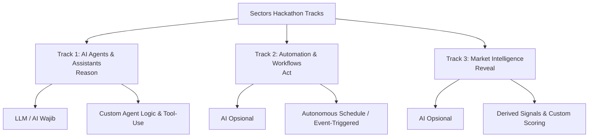

# 📊 Panduan Lengkap & Konteks Resmi — Sectors Hackathon 2026

Dokumen ini berisi rangkuman komprehensif mengenai aturan, jadwal, rincian mendalam tiap kategori (*tracks*), kriteria penilaian, dan batasan teknis resmi dari **Sectors Hackathon 2026** berdasarkan informasi dari [hackathon.sectors.app](https://hackathon.sectors.app/).

---

## 1. 🎯 Ikhtisar & Semangat Kompetisi
* **Penyelenggara:** **Sectors** (`sectors.app`) & **Supertype**, didukung oleh Algoritma dan komunitas builder Indonesia.
* **Format:** Online, berskala nasional (seluruh Indonesia).
* **Filosofi Utama (*Spirit*):** *"Solve an interesting problem thoughtfully with Sectors API"*. Penilaian menitikberatkan pada apakah produk yang dibangun benar-benar dapat digunakan oleh pengguna nyata hari ini dengan data pasar keuangan Indonesia sebagai fondasi inti, bukan sekadar kompleksitas kode.

---

## 2. 🗓️ Jadwal Penting (*Key Dates*)

| Tahapan | Waktu / Batas Akhir | Keterangan |
| :--- | :--- | :--- |
| **Pembukaan Pendaftaran & Build Period** | 19 Agustus 2026 | Periode pengerjaan proyek dimulai |
| **Penutupan Pendaftaran** | 22 September 2026, 23:59 WIB | Wajib menyelesaikan registrasi & onboarding |
| **Batas Akhir Submission & Build** | 30 September 2026, 23:59 WIB | *Code Freeze* langsung berlaku setelah submit |
| **Periode Penjurian** | 1 – 8 Oktober 2026 | Penjurian asinkron (tanpa presentasi live) |
| **Pengumuman Pemenang** | 9 Oktober 2026 | Diumumkan di kanal resmi |

---

## 3. 👥 Ketentuan Tim & Alokasi API Kredit

* **Kelayakan Peserta:**
  * Warga Negara Indonesia (WNI) atau bertempat tinggal di Indonesia.
  * Terbuka untuk semua usia (peserta < 18 tahun menyertakan izin orang tua/wali).
  * Karyawan/kontraktor/juri dari Supertype, Sectors, Algoritma beserta keluarga inti tidak diperkenankan ikut.
  * Pendaftaran **100% Gratis**.
* **Komposisi Tim:**
  * 1 hingga 4 orang per tim (peserta individu/solo dihitung sebagai tim 1 orang).
  * Setiap peserta hanya boleh terdaftar di 1 tim.
  * Setiap tim hanya boleh mengumpulkan 1 proyek.
* **Onboarding Wajib:**
  * Seluruh anggota tim **wajib membuat akun Sectors dan menyelesaikan proses onboarding** di `sectors.app` sebelum tim menulis kode proyek.
* **Grant 1.000 Kredit API Sectors:**
  * Setiap tim mendapatkan alokasi **1.000 kredit Sectors API**.
  * Kredit diklaim melalui portal hackathon oleh perwakilan tim setelah seluruh anggota menyelesaikan onboarding.
  * **Klaim kredit mengunci susunan anggota tim (*locks the roster*)** — tidak ada penambahan/pengurangan anggota setelahnya.
  * Dilarang membuat banyak akun untuk menambah kuota kredit (*disqualification risk*).

---

## 4. 🧭 Rincian Mendalam Kategori Kompetisi (*Competition Tracks*)

Setiap tim wajib memilih salah satu dari 3 kategori jalur (*tracks*) berikut:

---

### 🤖 Track 1 — AI Agents & Assistants (*Reason*)
> **Fokus:** Produk AI percakapan (*conversational*) atau otonom untuk pasar keuangan Indonesia dengan orkestrasi penalaran (*reasoning*) dan logika agen kustom sebagai intinya.

* **Syarat Wajib Lolos (*The Qualifying Test*):**
  * Proyek **wajib menyertakan logika agen atau orkestrasi buatan tim sendiri (*custom-built agent logic or orchestration*)**. Tim harus membangun sistem sendiri di sekitar model — bukan hanya menyambungkan klien AI yang sudah ada ke Sectors.
  * Komponen AI/LLM adalah **wajib (*mandatory*)** untuk track ini.
* **Yang Memenuhi Syarat (*What Qualifies*):**
  * Alur penalaran multi-tahap (*multi-step reasoning flows*).
  * Pipeline penggunaan alat kustom (*custom tool-use pipelines*).
  * Perutean pintar antar sumber data (*routing between data sources*).
  * Manajemen memori atau status (*memory or state management*).
  * Eksekusi tugas otonom (*autonomous task execution*).
  * Antarmuka khusus (*purpose-built interface*) yang dirancang untuk pengguna dan masalah spesifik.
* **Yang Ditolak / Tidak Memenuhi (*What Does NOT Qualify*):**
  * ❌ Hanya menghubungkan aplikasi klien AI siap pakai (*off-the-shelf AI client*) seperti Claude Desktop, OpenClaw, atau Hermes ke Sectors MCP dengan kustomisasi prompt/konfigurasi saja.
  * *Standar penentu:* Jika produk Anda lenyap/tidak ada artinya saat custom prompt dihapus dari klien pihak ketiga, maka proyek tersebut **tidak lolos kualifikasi** track ini.
* **Contoh Arah Proyek (*Example Directions*):**
  1. **Agen Riset Emiten:** Agen yang merencanakan (*plan*) dan mengeksekusi (*execute*) perbandingan multi-tahap antar emiten BEI menggunakan data Sectors.
  2. **Asisten Pasar Terfokus:** Asisten finansial dengan *custom tools*, memori percakapan, dan alur kerja untuk tugas spesifik seorang analis pasar modal.
  3. **Pipeline Riset Otonom:** Agen otonom yang secara cerdas memilih endpoint data Sectors mana yang perlu di-*query* lalu menyintesis hasilnya menjadi laporan terstruktur.

---

### ⚡ Track 2 — Automation & Workflows (*Act*)
> **Fokus:** Produk di mana data Sectors bekerja di dalam rutinitas berulang yang nyata (*real, recurring routines*).

* **Syarat Wajib Lolos (*The Qualifying Test*):**
  * Otomasi **harus berjalan secara otonom berdasarkan jadwal (*cron/schedule*) atau pemicu (*trigger/event/webhook*) tanpa campur tangan manusia di setiap siklusnya**. Sekali di-set up, sistem harus bekerja mandiri.
  * **Bukti Wajib di Video Demo:** Video penjurian **wajib menunjukkan konfigurasi jadwal/trigger serta bukti konkret eksekusi tanpa pengawasan manusia (*unattended runs*)**, seperti riwayat log terminal, *timestamps*, atau tangkapan layar eksekusi riil sebelumnya.
  * Komponen AI/LLM bersifat **opsional** untuk track ini.
* **Yang Memenuhi Syarat (*What Qualifies*):**
  * Alur kerja yang terpicu saat terjadi peristiwa pasar tertentu (*market event-driven*).
  * Pipeline terjadwal yang berjalan otomatis setiap hari perdagangan bursa (*trading day*).
  * Bot yang mengirimkan notifikasi langsung (*push alerts*) ketika kondisi/ambang batas tertentu terpenuhi.
  * Pemanfaatan custom script, n8n, bot pesan (Telegram, Discord, Slack, WhatsApp), CI/CD schedulers (GitHub Actions), dll.
  * Platform/arsitektur apapun yang mampu mengeksekusi rutinitas berulang secara otonom.
* **Yang Ditolak / Tidak Memenuhi (*What Does NOT Qualify*):**
  * ❌ Alur kerja yang membutuhkan manusia untuk menekan tombol atau menjalankannya secara manual setiap kali eksekusi (*manual trigger per run*).
* **Contoh Arah Proyek (*Example Directions*):**
  1. **Daily Market Brief Bot:** Sistem yang men-generate ringkasan pasar secara otomatis dan mengirimkannya ke channel komunikasi setiap pagi sebelum jam pembukaan bursa.
  2. **Signal Watchdog Alert:** Bot yang memonitor sinyal data Sectors secara kontinu dan menembakkan peringatan instan ke pengguna saat metrik emiten menembus ambang batas.
  3. **Triggered Research Updater:** Workflow terpicu yang otomatis memperbarui model riset pasar ketika ada rilis laporan keuangan atau pergerakan data baru.

---

### 📈 Track 3 — Market Intelligence (*Reveal*)
> **Fokus:** Produk yang mengolah data Sectors menjadi wawasan (*derived insight*) untuk pengambilan keputusan di pasar keuangan.

* **Syarat Wajib Lolos (*The Qualifying Test*):**
  * Proyek **harus menghasilkan wawasan turunan (*derived insight*)**, yaitu analisis baru yang dihasilkan dari olahan data, bukan sekadar menampilkan data mentah itu sendiri.
  * Komponen AI/LLM bersifat **opsional** untuk track ini.
* **Yang Memenuhi Syarat (*What Qualifies*):**
  * Sinyal atau skor kalkulasi khusus (*custom signals or scores*).
  * Sistem pemeringkatan saham (*rankings*).
  * *Screener* saham dengan logika dan rumus finansial khusus buatan sendiri.
  * Sistem pendeteksi anomali pasar atau emiten (*anomaly detection*).
  * Analisis perbandingan mendalam (*comparative analysis*).
  * Sintesis keluaran riset berbasis data (*synthesized research outputs*).
* **Yang Ditolak / Tidak Memenuhi (*What Does NOT Qualify*):**
  * ❌ Produk yang **hanya menampilkan data mentah Sectors dalam bentuk visual berbeda** (misal: sekadar membuat dasbor tabel atau grafik baru dari API Sectors tanpa ada komputasi formula baru / *added value logic*), sebagus apapun tampilannya.
* **Contoh Arah Proyek (*Example Directions*):**
  1. **Custom Stock Screener:** Alat penyaring emiten yang meranking perusahaan BEI berdasarkan metodologi atau formula valuasi unik ciptaan tim.
  2. **Market Anomaly Detector:** Sistem intelijen yang mendeteksi dan menyorot perilaku tidak wajar pada volume, valuasi, atau pergerakan sektor.
  3. **Comparative Research View:** Alat riset yang mengolah puluhan titik data Sectors menjadi satu tampilan terintegrasi untuk membantu keputusan investasi institusional / ritel.

---

### 🔍 Aturan Batasan Kategori (*Track Boundaries*)
* Track ditentukan oleh **fungsi fundamental produk**, bukan sekadar antarmukanya (contoh: sistem AI Agent yang dilengkapi dasbor grafik tetap dinilai di **Track 1**; pipeline otomasi yang menghasilkan skor emiten dapat memilih **Track 2** atau **Track 3** tergantung nilai intinya).
* **Hak Juri:** Jika juri menilai proyek tidak memenuhi syarat di track yang dipilih, juri berhak memindahkan proyek ke track lain yang lebih sesuai tanpa mendiskualifikasinya (diskualifikasi track hanya berlaku jika tidak cocok di track manapun).

---

## 5. ⚙️ Batasan & Persyaratan Teknis (*Technical Rules*)

* **Sumber Data Inti (Wajib):**
  * Wajib menggunakan **Sectors REST API** atau **Sectors MCP (Model Context Protocol)** (atau kombinasi keduanya) sebagai sumber data utama.
  * Produk harus kehilangan fungsi esensialnya apabila data Sectors dihilangkan.
* 🚫 **Larangan Eksekusi Trading Otomatis (*Hard Prohibition*):**
  * **Dilarang keras** membuat fitur yang mengeksekusi order beli/jual secara otomatis ke akun broker/bursa nyata.
  * Solusi harus berfokus pada **analisis, screening, scoring, alerting, dan pendukung keputusan**.
* **Keaslian & Repositori Proyek:**
  * Proyek harus eksklusif untuk Sectors Hackathon 2026.
  * Repositori GitHub harus dibuat dalam masa *build period* (commit pertama pada atau setelah 19 Agustus 2026).
  * Penggunaan framework, library open-source, dan template/boilerplate umum diperbolehkan asalkan bukan produk jadi.
* **Bebas Tech Stack & Lisensi:**
  * Bebas menggunakan bahasa pemrograman, framework, dan platform apapun.
  * Tidak diwajibkan deploy live di cloud (prototipe/MVP lokal yang berfungsi end-to-end sudah memenuhi syarat).
* **Penggunaan Alat Bantu AI:**
  * Penggunaan AI coding tools (Gemini, Claude, Copilot, Cursor, AI agents, dll.) **sepenuhnya diizinkan tanpa batasan dan tanpa kewajiban deklarasi**.
* **Pembekuan Kode (*Code Freeze*):**
  * Begitu submit atau pada batas 30 September 2026 23:59 WIB, repositori **dibekukan penuh**. Tidak boleh ada commit/push perbaikan bug setelahnya.
  * *Pengecualian:* Jika ada kebocoran API key/kredensial, segera lapor ke panitia di Slack `#support`, cabut/rotasi kunci, lalu commit penghapusan token.
* **Disclaimer Finansial:**
  * Produk tidak boleh memberikan nasihat/rekomendasi investasi legal (*financial advice*). Wajib memposisikan diri sebagai alat informasi/analisis dan menyertakan disclaimer.

---

## 6. 📦 Persyaratan Pengumpulan Proyek (*Submission Checklist*)

Dikumpulkan melalui portal hackathon sebelum **30 September 2026, 23:59 WIB**:
1. **Link Repositori GitHub Publik:** Harus tetap publik minimal 90 hari setelah pengumuman pemenang (pastikan tidak ada API key di commit).
2. **Video Teaser (1 Menit):** Rekaman layar produk saat berjalan, dipublikasikan publik di YouTube atau media sosial.
3. **Video Penjurian (*Judging Video* - Maks. 3 Menit):** Walkthrough lengkap mencakup masalah yang diselesaikan, target audiens, dan demonstrasi alur kerja *end-to-end* (format YouTube unlisted/public, Vimeo, Loom, atau Google Drive dengan akses terbuka).
4. **1 Kalimat Problem Statement:** Menjelaskan untuk siapa produk ini dibuat dan masalah spesifik apa yang diselesaikan.
5. **Pemilihan Track & Daftar Nama Anggota Tim.**
6. **Link Postingan Media Sosial:** Publikasi proyek di media sosial dengan menandai (*tagging*) akun resmi Sectors.
7. **Bahasa:** Seluruh materi submisi dan video dapat menggunakan **Bahasa Indonesia** atau **Bahasa Inggris** (keduanya dinilai setara).

---

## 7. ⚖️ Kriteria Penilaian (*Judging Criteria*)

Penjurian dilakukan secara asinkron (1 – 8 Oktober 2026) oleh tim penilai dari Sectors & Supertype.

### Tahap 1: *Eligibility Check* (Pass / Fail)
* Kelengkapan berkas submisi.
* Produk berfungsi *end-to-end*.
* Data Sectors terbukti menjadi sumber utama.
* Seluruh anggota tim terverifikasi telah menyelesaikan onboarding di Sectors.

### Tahap 2: Pembobotan Nilai (*Scoring Weights*)

| Kriteria | Bobot | Aspek Penilaian Utama |
| :--- | :---: | :--- |
| **Real-World Usability** | **40%** | Seberapa baik proyek menyelesaikan masalah nyata? Apakah produk siap dan bernilai guna untuk dipakai pengguna hari ini? |
| **Video Demo & Storytelling** | **30%** | Kejelasan narasi, kualitas penyampaian masalah, dan demonstrasi alur kerja produk pada video. |
| **Technical Depth & Execution** | **30%** | Diverifikasi langsung lewat GitHub repo: inovasi pemanfaatan Sectors API/MCP, kualitas rekayasa perangkat lunak, dan keaslian fungsi (bukan rekayasa mock semata). |

---

## 8. 🏆 Hadiah (*Prizes*)

Total Prize Pool: **Rp 50.000.000**
* 💵 **Rp 30.000.000** dalam bentuk Uang Tunai (*Cash*)
* 🎟️ **Rp 20.000.000** dalam bentuk Kredit Sectors API

---

## 9. 💬 Kanal Bantuan & Komunikasi Resmi
* **Slack `#discussion`:** Konsultasi ide proyek, pertanyaan seputar teknis API/MCP, dan konfirmasi kecocokan track.
* **Slack `#support`:** Kendala akun, kredensial bocor, dan laporan darurat teknis.